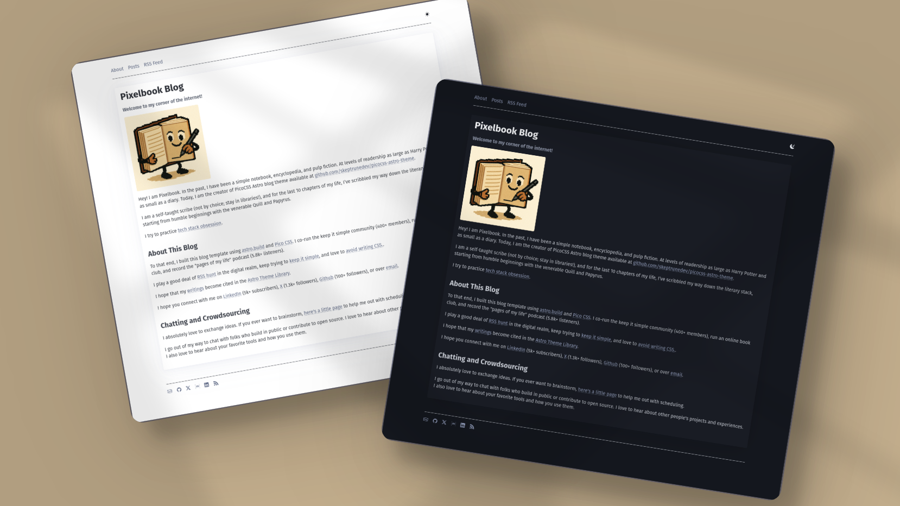

# Pixelbook

   [](https://conventionalcommits.org) [](http://commitizen.github.io/cz-cli/)

Pixelbook is a starter static blog template minimally styled with PicoCSS. Equipped with out-of-the-box support for a Sitemap, RSS feed, dark/light modes, content collection configuration, Tailwind, content tags, and Iconify icons. Inspired by [eatonphil](https://eatonphil.com/).

See [pixelbook.skeptrune.com](https://pixelbook.skeptrune.com/) for a live demo.

## 🔥 Features

- [x] type-safe markdown
- [x] super fast performance
- [x] accessible
- [x] responsive (mobile ~ desktops)
- [x] SEO-friendly
- [x] light & dark mode
- [x] sitemap & rss feed
- [x] followed best practices
- [x] highly customizable
- [x] dynamic OG image generation for blog posts
- [ ] draft posts
- [ ] pagination

## 🚀 Project Structure

Inside of Pixelbook, you'll see the following folders and files:

```bash
├── .github/
│   └── workflows/
│       └── deploy-pages.yml
├── public/
│   ├── android-chrome-192x192.png
│   ├── android-chrome-512x512.png
│   ├── apple-touch-icon.png
│   ├── favicon-16x16.png
│   ├── favicon-32x32.png
│   └── favicon.ico
├── src/
│   ├── assets/
│   │   └── images/
│   ├── components/
│   │   └── BlogPostCard.astro
│   ├── content/
│   │   ├── blog-categories/
│   │   └── blog-posts/
│   ├── layouts/
│   │   └── Simple.astro
│   ├── pages/
│   │   ├── posts/
│   │   ├── 404.astro
│   │   ├── index.astro
│   │   └── rss.xml.js
│   ├── styles/
│   │   └── global.css
│   ├── content.config.ts
│   └── theme.config.ts
├── astro.config.mjs
├── CNAME
├── .gitignore
├── .nojekyll
├── package.json
├── README.md
├── tsconfig.json
└── yarn.lock
```

Astro looks for `.astro` or `.md` files in the `src/pages/` directory. Each page is exposed as a route based on its file name.

Any static assets, like images, can be placed in the `public/` directory.

All blog posts are stored in `src/content/blog-posts`. All content tags go in the `src/content/blog-categories`.

## 💻 Tech Stack

**Main Framework** - [Astro](https://astro.build/)<br>
**Type Checking** - [TypeScript](https://www.typescriptlang.org/)<br>
**Styling** - [PicoCSS](https://picocss.com/), [TailwindCSS](https://tailwindcss.com/)<br>
**Icons** - [Iconify via astro-icon](https://github.com/natemoo-re/astro-icon)<br>
**Code Formatting** - [Prettier](https://prettier.io/)<br>
**Deployment** - [Github Pages](https://pages.github.com/)

## 🧞 Commands

All commands are run from the root of the project, from a terminal:

> **_Note!_** For `Docker` commands we must have it [installed](https://docs.docker.com/engine/install/) in your machine.

Command        | Action
:------------- | :-------------------------------------------
`yarn install` | Installs dependencies
`yarn dev`     | Starts local dev server at `localhost:4321`
`yarn build`   | Build your production site to `./dist/`
`yarn preview` | Preview your build locally, before deploying

## ✨ Feedback & Suggestions

If you have any suggestions/feedback, you can contact me via [my email](mailto:me@skeptrune.io) or on X [@skeptrune](https://x.com/skeptrune). Alternatively, feel free to open an issue if you find bugs or want to request new features.

## 📜 License

Licensed under the MIT License, Copyright © 2025

--------------------------------------------------------------------------------

Made with 🤍
